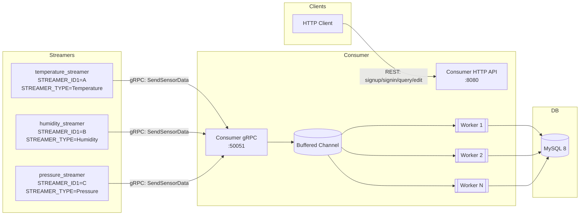
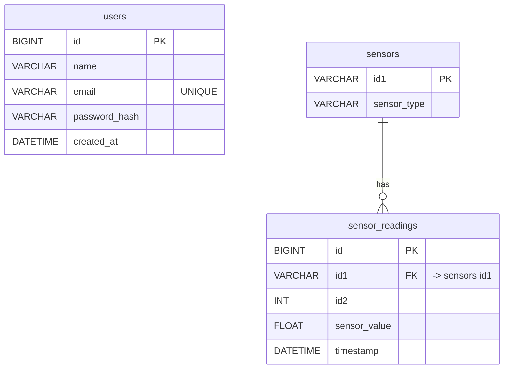

## Assessment – Sensor Streaming System

Two microservices with MySQL:

- Consumer Service (REST + gRPC): receives streamed sensor data, persists to MySQL, exposes query/edit APIs, and provides user auth with JWT. Uses a worker-pool to insert streamed data.
- Streamer Service (HTTP control + gRPC client): generates sensor data and streams it to Consumer. Multiple streamer instances run concurrently, each with a fixed sensor type/ID.

### Architecture



### Repository layout

- `Consumer_Serivce/` – Consumer service (HTTP, gRPC, DB access, auth, workers)
- `Streamer_Serivce/` – Streamer service (gRPC client, HTTP control)
- `docker-compose.yml` – DB + Consumer + multiple Streamers
- `Makefile` – top-level compose helpers (up/down/logs/ps)

### Run with Docker Compose

From the repo root:

```bash
make up         # build and start all services (detached)
make logs       # tail logs for all containers
make ps         # show status and ports
make down       # stop and remove containers/volumes
```

Default ports:

- Consumer HTTP: `localhost:8080`
- Consumer gRPC: `localhost:50051`
- Streamers HTTP: `localhost:8081`, `8082`, `8083` (per instance)
- MySQL: host mapping can be changed; default is `3306:3306` (change if taken)

### Environment variables

Consumer (see `Consumer_Serivce/README.md` for details):

- `ADDR` (default `:8080`)
- `GRPC_PORT` (default `:50051`)
- `JWT_SECRET` (default `dev-secret-change`)
- `DB_ADDR` (default DSN uses `loc=UTC`)
- `INGEST_WORKERS` (default `4`) – number of worker goroutines
- `INGEST_BUFFER` (default `1024`) – size of buffered channel

Streamer (per instance):

- `MICROSERVICE_B_ADDR` – gRPC address of Consumer (e.g., `consumer:50051` in compose)
- `HTTP_PORT` – HTTP listen port inside the container (default `:8080`)
- `STREAMER_ID1` – sensor ID key (e.g., `A`, `B`, `C`)
- `STREAMER_TYPE` – sensor type label (e.g., `Temperature`)

### Database & migrations

- MySQL 8 is provided by compose
- Consumer embeds and runs all `cmd/migrate/migrations/*.up.sql` automatically on startup
- `users` table uses `DATETIME` for `created_at`, inserted in UTC by server

### Auth and APIs (Consumer)

Public:

- `POST /api/v1/signup` – body: `{ "name", "email", "password" }`
- `POST /api/v1/signin` – body: `{ "email", "password" }` → `{ token }`

Protected (JWT in `Authorization: Bearer <token>`):

- `PUT /api/v1/sensordata/query`
- `PUT /api/v1/sensordata/history`
- `PUT /api/v1/sensordata/query-history`

Queries and deletes:

- `GET /api/v1/sensordata/query`
- `GET /api/v1/sensordata/history`
- `GET /api/v1/sensordata/query-history`
- `DELETE /api/v1/sensordata/...`

### Streamers

- Each streamer instance sends data for a fixed `(STREAMER_ID1, STREAMER_TYPE)`
- Adjust streaming frequency via HTTP:

```bash
curl -X POST http://localhost:8081/api/v1/frequency \
  -H 'Content-Type: application/json' \
  -d '{"frequency_seconds": 5}'
```

### Worker pool (Consumer)

- gRPC handler enqueues sensor points onto a buffered channel
- `INGEST_WORKERS` goroutines read from the channel and insert into MySQL
- Backpressure: the channel size (`INGEST_BUFFER`) controls burst absorption

### Troubleshooting

- MySQL port busy: change compose mapping (e.g., `3307:3306`) or stop local MySQL
- No logs after `make up`: use `make logs` (compose runs detached by default)
- DB DSN quoting: ensure `DB_ADDR` env has no surrounding quotes; the service trims common whitespace/quotes

### Database ERD (Mermaid)


